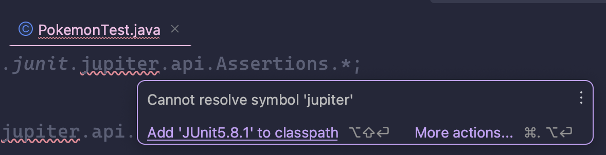
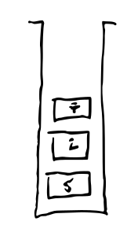
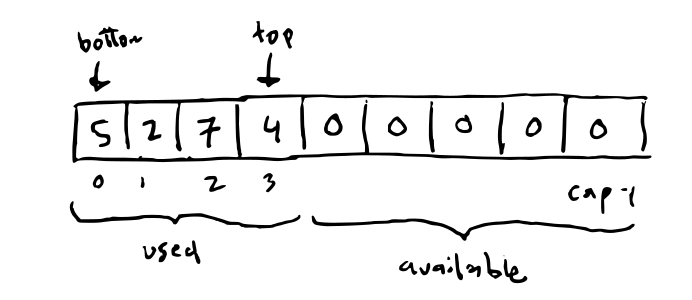

# Exercise 3.3 - 🥞 Stacks

## 🎯 Objectives

- **Implement** an array-based stack data structure in Java.

## 🔨 Setup

1. Clone the repo (or download the zip) for this exercise, which you can find [here](https://github.com/JAC-CS-Programming-4-W23/E3.3-Stacks).
2. Start IntelliJ, go to `File -> Open...`, and select the cloned/downloaded folder.
3. If at the top it says "Project JDK is not defined", click "Setup JDK" on the top right, and select the JDK version you have installed on your machine.

   

4. To get the unit tests to work, open `StackTest.java` and add JUnit to the classpath:

   

   - Just click "OK" on the resulting dialogue window and all the test-related red squigglies should disappear.

## 🔍 Context

We will keep things simple and only handle stacks of integers. It would be easy enough, if mildly annoying, to recreate this class later on for other datatypes, for example `double` or `String`. Soon enough, we will cover *generics* which will make this a lot easier!

How should we use an array to store a stack? The most natural way seems to be: store the elements in the lower portion of the array with the bottom at position `0` and the top in the highest index position:

For example, the stack

would be stored in an array:

## 🚦 Let's Go

1. Create a class `IntStack`.
2. Add the necessary fields to store stack.
3. Create two constructors: one where the stack `capacity` is provided and one where it is not, relying on a default `STACK_CAPACITY` that you can decide.
4. Implement the methods of the `Stack` API: `push(..)`, `pop()`, `top()`, `isEmpty()` and `isFull()`.
5. Throw exception `StackOverflowException` and `StackUnderflowException` when the caller has not met the operation preconditions.
6. Pass the unit test in the class `TestStack`.

### 👑 Bonus 1 - Bracket Balancer

See if you can code the bracket balancer algorithm that we did in E3.2! There's a blank method for you in `Main` and tests in `TestStack` that call `Main.balancer()`.

### 👑 Bonus 2 - Stackable Interface

1. Create a `Stackable` interface which includes the necessary methods for a stack.
2. Have your `IntStack` implement the `Stackable` interface and override all the interface's methods.
3. You can have the interface just use `int`s, but for an extra challenge, can you make it use generics instead?
   - No worries if you can't do this last part because we'll be learning generics later in the semester!

## 🔬 Observations

- For us, checking preconditions results in throwing exceptions. In theory, we could just let the code run and whatever happens is the caller's fault. Here that would be an `ArrayBoundsException` of some sort.
- Throwing `StackOverflowException` and `StackUnderflowException` makes it clear which precondition was violated by the caller.
- There is a temptation to "erase" the value when popping. This isn't necessary in our implementation. Why? The field `tos` is tracking the currently used portion of the array. When you pop, you adjust `tos` to indicate that the used portion of the array has changed. When you push, you increase the used portion, but at the same time overwrite an previous stack element. The private accessibility use on all these fields gives us the guarantee that only `push()` and `pop()` manipulate our array, so there is no need to "reset" these cells.
  - Also: there is no value that you can use to "reset" anyway. Regardless of the value used we can imagine an application adding this value the stack as part of it's operation.

---

